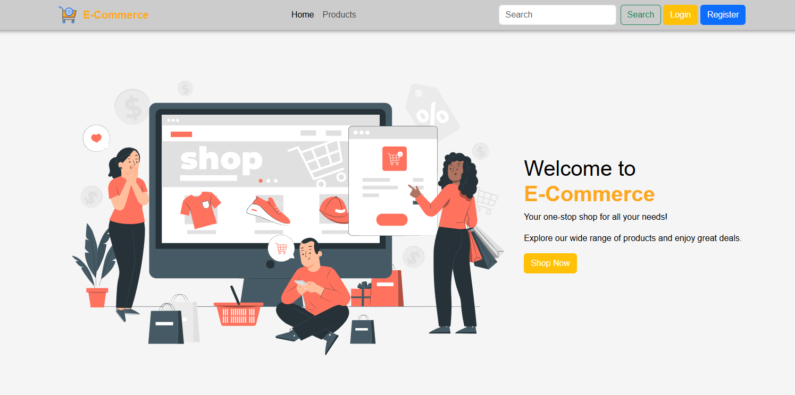

# 🛒 E-Commerce Website

This is a simple e-commerce website developed as a **graduation project** for the NCW Front-End Course by Sprints.

It is built using **HTML**, **CSS**, **Vanilla JavaScript**, and **Bootstrap 5**, and allows users to browse products, register, log in, and manage a shopping cart with data stored in `localStorage`.

---

## 🚀 Features

- ✅ **User Registration and Login** with validation
- ✅ **Product listing** from [FakeStore API](https://fakestoreapi.com/)
- ✅ **Responsive design** using Bootstrap Grid
- ✅ **Add to Cart** with quantity updates & total price
- ✅ **Cart Persistence** using `localStorage`
- ✅ **Remove Items** from cart with confirmation popup
- ✅ **Add Custom Products** via form saved to `localStorage`
- ✅ **Display Custom Products** dynamically alongside API products
- ✅ **Custom Popup Windows** with ESC key to close and styled headers
- ✅ **Session Management** using `sessionStorage`
- ✅ **Dynamic UI Update** on login/logout
- ✅ **Truncated product names** for clean layout
- ✅ **Styled product categories** with Bootstrap badges
- ✅ **Improved layout and spacing** using Bootstrap utilities

---

## 🧰 Technologies Used

- **HTML5**
- **CSS3**
- **JavaScript (Vanilla)**
- **Bootstrap 5**
- **FakeStore API**
- **LocalStorage & SessionStorage**

---

## 🎥 Demo Video

Click the image below to watch a short demo of the project in action:

---

## 🌐 Live Demo

Try the live version of this project here:

🔗 [Live Demo](https://khaledradwan96.github.io/E-Commerce/)
